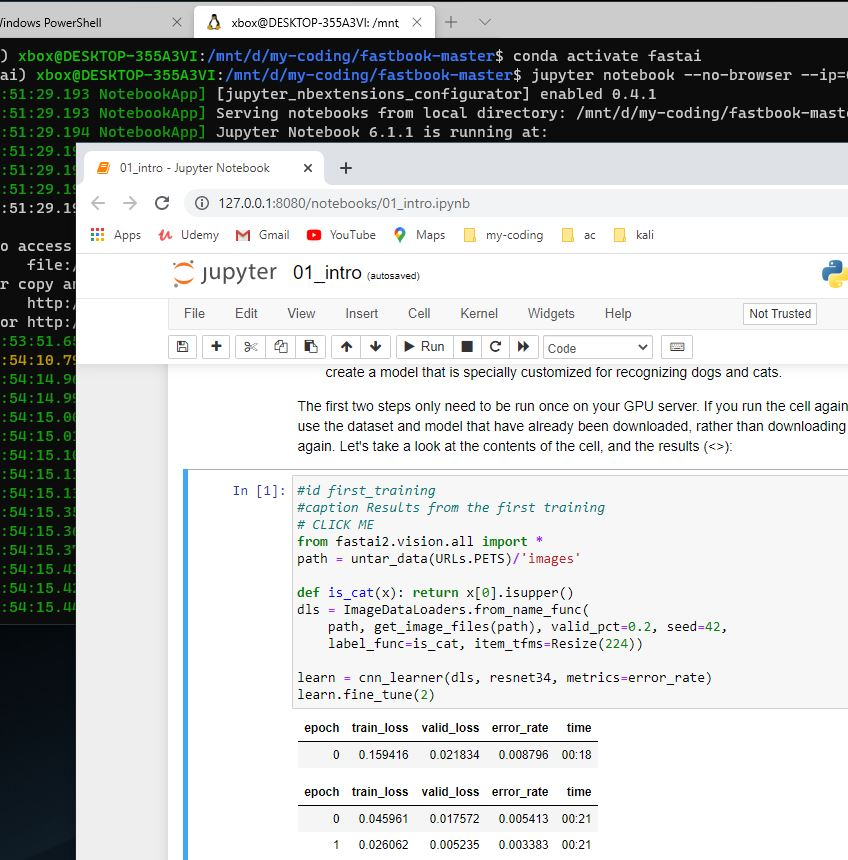

# 100 days of fastai

my notes as i dig into fastai

my game plan is to spend about an hour a day with fastai using the book and online resources to get a deep understanding of fastai

## resources
[fastai book home](https://book.fast.ai "fastai book home")

[fastai book repo](https://github.com/fastai/fastbook "fastai book repo")

[fastai docs](https://docs.fast.ai/ "fastai docs")

[my fastai.100days repo](https://github.com/philipwalsh/fastai.100days "my fastai.100days repo")

## daily notes
### day 1 - initial setup

book files downloaded and unzipped from gituhb repo

`my-coding\fastbook-master`

my fastai [repo](https://github.com/philipwalsh/fastai.100days "my fastai.100days repo") created

`my-coding\fastai.100days`

installing wsl 2.0 and cuda

i am following this youtube video

https://www.youtube.com/watch?v=0iNHHSS81Xc

nvidia install here

https://docs.nvidia.com/cuda/wsl-user-guide/index.html#running-cuda

cuda samples here

https://github.com/NVIDIA/cuda-samples

a better pcommand prompt

https://github.com/mintty/wsltty/releases

### day 2

today I am attempting to update WSL 1 to WSL 2

things always appear easy at first, then you get down into the weeds.

### day 3
the frustration continues

side note

from "DL for Coders with fastai & Pytorch", page 14, "setting up a computer takes time and energy... we suggest you rent access to computer ..."

so sure, the book warned me not to go through this computer install but thats ok.  I call this a valuable learning experience and if i can get the jupyter notebook experience up and running on my nvidia card then I have the option to work local

I can always move my dev to the cloud based training environments in the future

I believe I have the proper version of wsl installed finally but i am receiving error

`WslRegisterDistribution failed with error: 0x800706be`

when i try to re install ubuntu

after a few searches across the interwebs i was told that i should restart the subsystem nanager and clean the image with...

`sc query LxssManager`

`sc stop LxssManager`

`sc start LxssManager`

`sfc /scannow`

`dism /Online /Cleanup-Image /RestoreHealth`

I believe the last line that cleans the image was the one that go me back on track

Time to log into the WSL ubuntu image to complete the cuda installation there

Based on recommendation from the youtube video, i am using wsltty to complete the cuda install

I follow all of the steps that nvidia has on their install page

all that is left is to test a sample to verify cuda driver install

`cd usr/local/cuda/samples`

`sudo make`

wait for the process to make all the samples.  this takes a few minutes to complete on my system

`Intel(R) Core(TM) i7-6700K CPU @ 4.00GHz   4.00 GHz`

Now i can get into the bin folder and verify the install

`cd bin`

`./deviceQuery`

and i am very happy, the sample runs

first card found

`Device 0: "GeForce RTX 2080"`

`  CUDA Driver Version / Runtime Version          11.1 / 11.0`

`  CUDA Capability Major/Minor version number:    7.5`

`  Total amount of global memory:                 8192 MBytes (8589934592 bytes)...`

...

second card found

`Device 1: "GeForce GTX 970"`

`  CUDA Driver Version / Runtime Version          11.1 / 11.0`

`  CUDA Capability Major/Minor version number:    5.2`

`  Total amount of global memory:                 4096 MBytes (4294967296 bytes)`

WSL 2 now has access to my GPU

one more test to check my GPU performance

`./matrixMul`

`[Matrix Multiply Using CUDA] - Starting...`

`GPU Device 0: "Turing" with compute capability 7.5`

`MatrixA(320,320), MatrixB(640,320)`

`Computing result using CUDA Kernel...`

`done`

`Performance= 946.94 GFlop/s, Time= 0.138 msec, Size= 131072000 Ops, WorkgroupSize= 1024 threads/block`

`Checking computed result for correctness: Result = PASS`

964 GFlop/s, sounds ok to me

now I can treat the WSL as a remote machine, spin up a service in the WSL Ubuntu and then from windows use that server

setting up my Ubuntu anaconda, with a little help from 

https://www.digitalocean.com/community/tutorials/how-to-install-anaconda-on-ubuntu-18-04-quickstart

I think i have everything installed.

time to spin up the jupyter notebook environment, form Ubuntu

`jupyter notebook --no-browser --ip=0.0.0.0 --port=8000`

now from windows i can connect my browser to that ip and port and away i go

`http://127.0.0.1:8000/?token=...`

, supply the token and done

Page 16 - running first notebook worked fine.  

so after all of that what do I have.

- Windows dev environment
- Ubuntu on WSL
- fastai training models with GPU
- no need to rent cloud based GPU environment for training

pretty slick if you ask me

of course there may come a day when i want to use google colab for my training, thats fine.  For now I will keep the training local.

### day 4

Page 16-20

the book explains some jupyter notebook basics.  then the book jumps into a quick cat dog classifier.  in a few lines of code we are uploading and identifying our own cat dog images.  really neat.

the fastai library has built in image styes.  the book uses the cat/dog set and then a pre trained model, resnet34 in this case, to build the image classifer in about 6 lines of code.

i was curious to see if i had actually connected all the dots regarding the fastai library utilizing my gpu, here is the proof.

